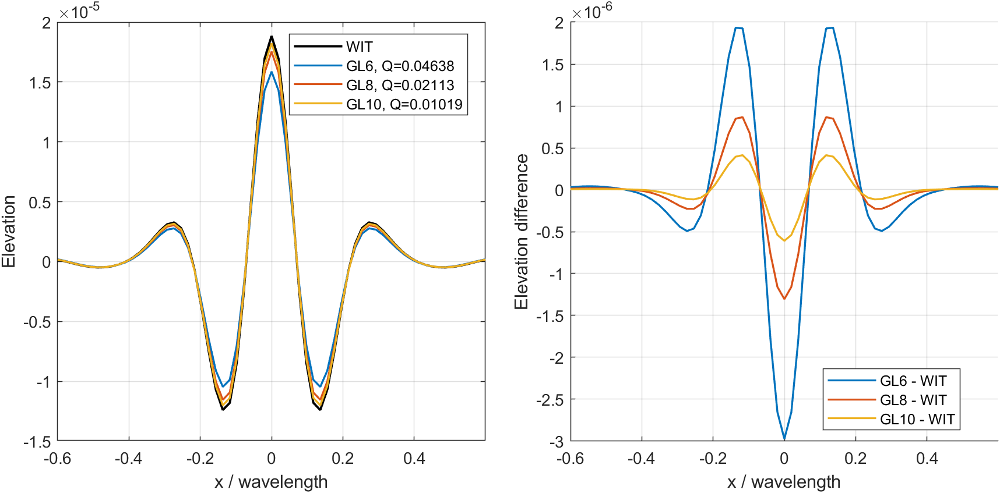
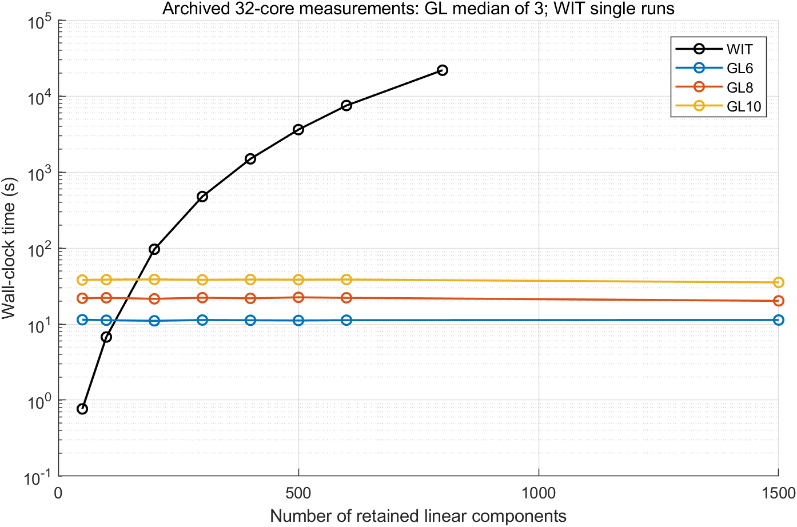

# Fourth-order GL versus Wave Interaction Theory

This self-contained package preserves the positive pure-sum elevation
comparison used in the paper: GL6/GL8/GL10 against fourth-order Wave
Interaction Theory (WIT), and the associated 32-core timing data. No Stokes
correction is used by either the MATLAB or C++ GL execution paths.

## Reproduce the paper field and timing panels

From the repository root, in MATLAB R2022b:

```matlab
setup_green_laplace
addpath('paper/order4')
reproduce_order4_fields(false) % replot the preserved 2D fields
reproduce_order4_fields(true)  % independently rerun GL6, GL8 and GL10
reproduce_order4_runtime      % plot the historical measured times
```

Figures and numeric tables are written under `results/order4/`. The field
panel shows a centreline and its raw difference, with Q computed from the
complete 2D fields. These are standalone fourth-order panels, not a replacement
for the paper's combined second-to-fourth-order figure layout.

The field case has 382 components, a 256 by 256 grid, 120-degree crossing,
30-degree per-lobe spreading, peak kh=1 and a five-wavelength domain.
The preserved WIT binary output regenerates the reference field. The GL
rerun exactly reproduced all three archived GL fields on MATLAB R2022b:

| GL rank | Raw relative L2 | Q |
|---:|---:|---:|
| 6 | 9.16566749% | 0.04638366593 |
| 8 | 4.20839344% | 0.02113064319 |
| 10 | 2.03486173% | 0.01019116041 |

Q is `norm(candidate-reference)/(norm(reference)+norm(candidate))`.
No fitted gain, phase, offset, coordinate shift or candidate-amplitude
normalization is applied. The complete fields and archived original metrics
are in `data/`; fresh migration checks are in `validation/`.



## Exact frozen inputs

`inputs/field_n0382` is the field-comparison case. `inputs/runtime/nXXXX`
contains the separate 512 by 512, ten-wavelength timing family. Runtime
cases are nested prefixes of 1500 original components, without amplitude
renormalization. Do not substitute one input family for the other.

Each case includes human-readable components, metadata and the original
`DIR4IN01` binary. The binary is authoritative for floating-point amplitudes;
CSV display precision is insufficient for byte-identical reconstruction.
The MATLAB adapter reads that binary, deposits only eta11, writes the C++ GL
input and checks that it reproduces the WIT input byte for byte:

```matlab
prepare_order4_inputs('paper/order4/inputs/runtime/n0050', ...
                     'results/order4/n0050')
```

## Build and check C++

Linux or WSL requires a C++17 compiler, OpenMP, FFTW3 with its threads library,
GNU patch and Python 3 (process orchestration only). MATLAB remains the
independent numerical validation implementation. Install FFTW development
headers with the operating system's package manager, or set `FFTW_PREFIX`
to an existing FFTW installation. FFTW itself is not vendored here.

```bash
bash paper/order4/build.sh
```

The default output is `artifacts/order4-build`. `build-report.txt` records
the compiler, flags, platform and executable hashes. For a custom FFTW prefix:

```bash
FFTW_PREFIX=/path/to/fftw bash paper/order4/build.sh
```

Run the compact parity check in this order:

```matlab
setup_green_laplace
addpath('paper/order4')
prepare_order4_cpp_smoke
```

```bash
bash paper/order4/run_cpp_smoke.sh
```

```matlab
validate_order4_cpp_smoke
```

The checked fixture uses three components on a 32 by 32 grid. C++ GL versus
MATLAB relative L2 errors were below 5e-16 for GL6/8/10. The split GL6 result
agreed to 6e-16. Materialized and streaming WIT results were identical in
this fixture. The historical C++ GL6 source was also rerun on the 256 by 256
paper input; its raw relative difference from the archived MATLAB GL6 field
was 1.7932e-10. The checks do not fit or retune either method.

## Run a GL--WIT comparison on a supplied case

After preparing `results/order4/n0050` as above:

```bash
python3 paper/order4/run_cpp.py gl results/order4/n0050/gl_input.bin \
  results/order4/n0050/gl6.bin --rank 6 --threads 1
python3 paper/order4/run_cpp.py wit results/order4/n0050/wit_input.bin \
  results/order4/n0050/wit.bin --threads 1
```

For bounded parallel GL evaluation, use `--split-workers 32` instead of
`--threads`. The Python runner launches the C++ executor and merges partial
outputs; it implements no kernel or governing residual. It reports a new
process wall time, including serialization and merge, so its JSON times must
not be silently substituted for historical paper rows.

The binary GL output is an analytic dimensionless elevation: physical eta44
is `h*real(field)`. WIT stores physical Fourier-series coefficients in x-first
order: `real(ifft2(etaFixedB(:,:,1).'*nx*ny))` reconstructs the physical field.
The readers and smoke validator show both conventions explicitly.

## Historical timing boundary and provenance

`data/runtime/eta44_runtime_figure_data.csv` preserves the paper rows,
including their original run identifiers and timing statistics. GL uses the
median of three measurements; WIT rows are single measured runs. Raw GL
repeats, the N=1500 endpoint, original order-four measurements, and the N=800
WIT row are also included. The original reference environment reported
Intel Xeon Silver 4214 CPUs and 48 exposed logical CPUs; jobs used CPUs
16--47. These are historical measurements, not new timings on the migration
machine. No 32-core timing campaign was rerun during this migration.

The historical GL launcher `run_gl_split.sh` is preserved byte for byte:
it launches rank*(rank+1) single-threaded tasks under a maximum concurrency
limit, measures launch-to-task-completion wall time, and merges afterward.
Its recorded wall time excludes the final merge. Example on a host with
the corresponding CPU allocation:

```bash
KEEP_PARTIALS=1 bash paper/order4/run_gl_split.sh \
  artifacts/order4-build/gl_eta44 artifacts/order4-build/merge_eta44_outer \
  results/order4/n0050/gl_input.bin results/order4/n0050/split 6 32 16
```

The paper's WIT timings used explicit unordered-quartet materialization,
not streaming enumeration. `wit_eta44_materialized` retains that source;
`wit_eta44` applies the preserved scheduling-only streaming patch. Use
`OMP_NUM_THREADS=32 .../wit_eta44_materialized INPUT OUTPUT --sector 44`
to select the historical enumeration. Large materialized runs have substantial
memory requirements: the archived N=800 row reports about 257 GiB peak RSS.
Do not compare a new streaming timing to the paper's materialized timing as
though the implementations were identical.

The GL source, WIT source and GL split launcher hashes all match their
historical records. The original GL source was recovered from the compute
archive and verified against its recorded SHA-256:
`6bd01d6c25fc146bd96eba1d16bd19b64972792d10187b79b8bbaf4b058fd201`.
The WIT source digest is
`bb1b6feaf3954a44a4ba35ba47f3a6e8fb93458081bf7239e39ca9bcd39c612c`.
Source provenance is recorded in `source_manifest.json`. Rebuilding with a
new compiler, FFTW build, operating system or CPU is not expected to reproduce
the old executable bytes or wall-clock times exactly.



This package supports only the declared fourth-order positive pure-sum
comparison. It does not extend the main total-field API or validate the other
sectors present in the historical WIT source. Machine-specific remote paths
and email notification launchers are not required or included.
